<div align="center">

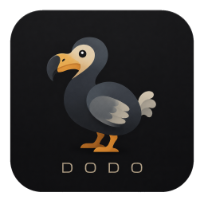

# Dodo

**A native desktop toolbox for developers.**

Format JSON, inspect APIs, manage containers and databases, clean up disk space, draw diagrams, and more — all in one app.

No browser tabs. No Electron.

</div>

> [!NOTE]
> **Dodo is pre-1.0 and under active development.**
> Features and persisted formats may change before 1.0.

## Features

### API Explorer

Build, send, and inspect HTTP requests with collections, environments, authentication, scripts, and multiple response views.

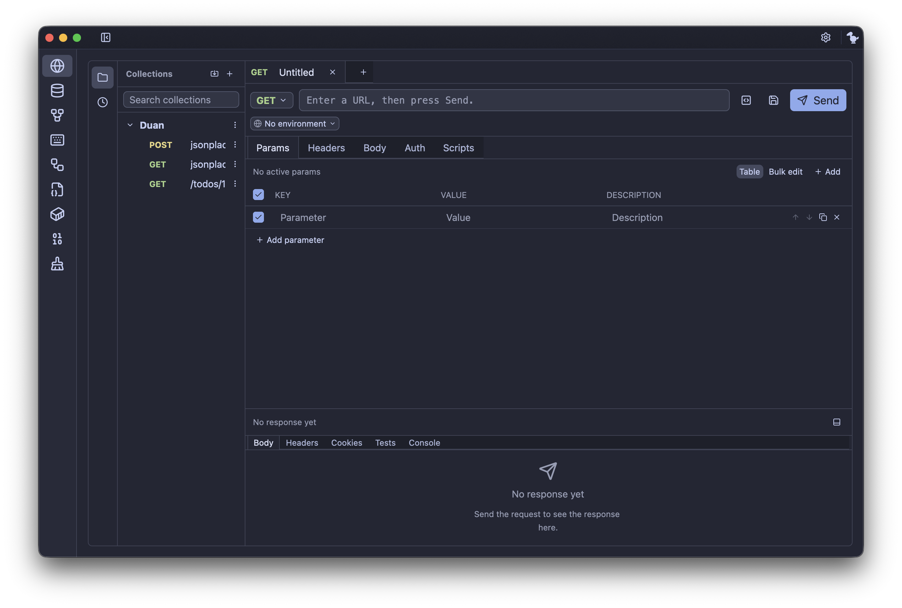

### Docker

Manage Docker and Podman containers, images, volumes, and networks, with logs, inspection, filtering, and lifecycle actions.

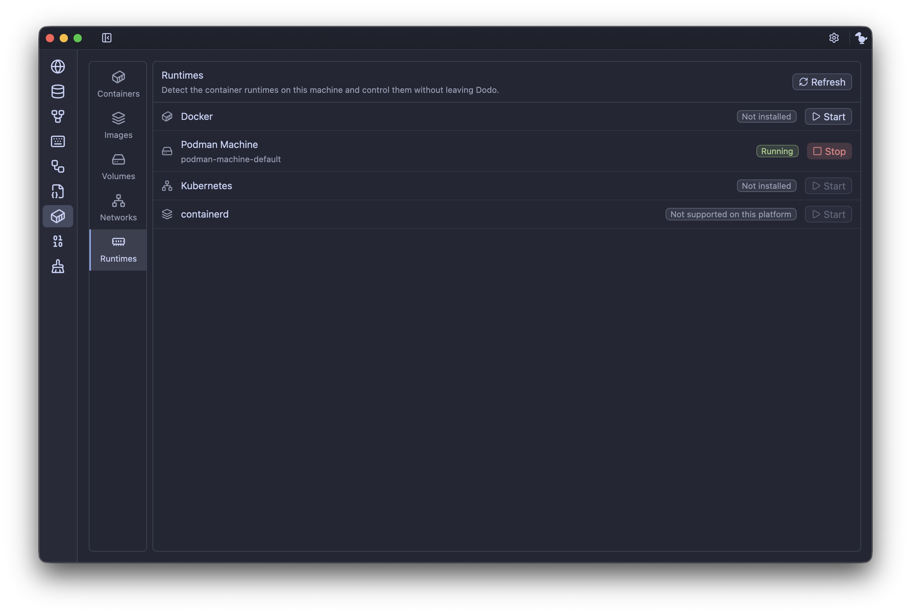

### Database Explorer

Connect to PostgreSQL, SQLite, MySQL, MariaDB, and Redis. Browse schemas, run queries, inspect tables, edit data, and export results.

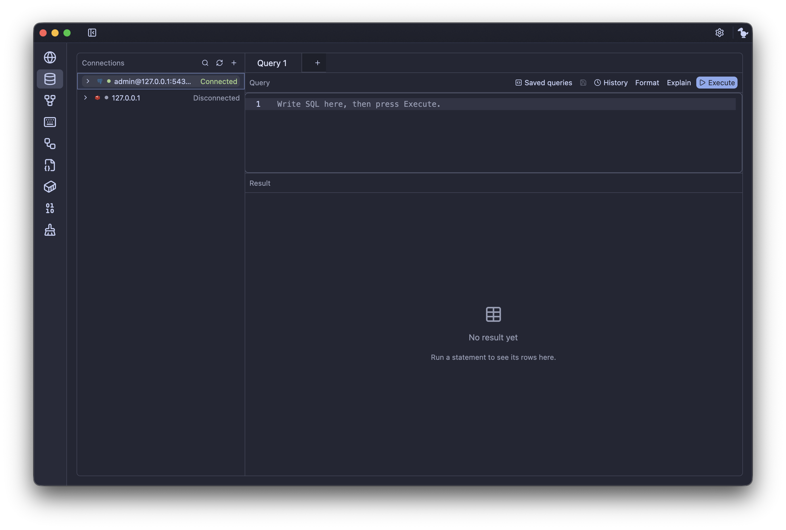

### Diagram

An infinite canvas for diagrams and node graphs with shapes, connectors, text, images, layers, and Clean / Sketch rendering.

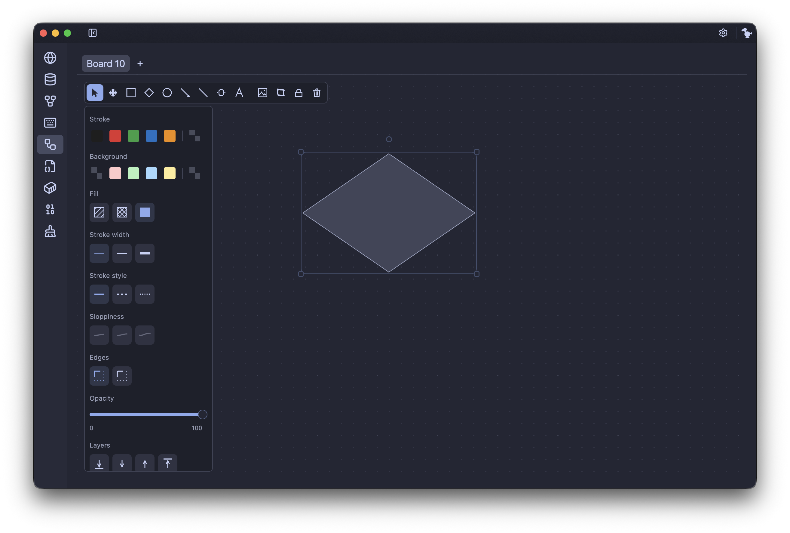

### Cleaner

Scan and safely clean system, application, and developer junk while keeping deletion behind an explicit review step.

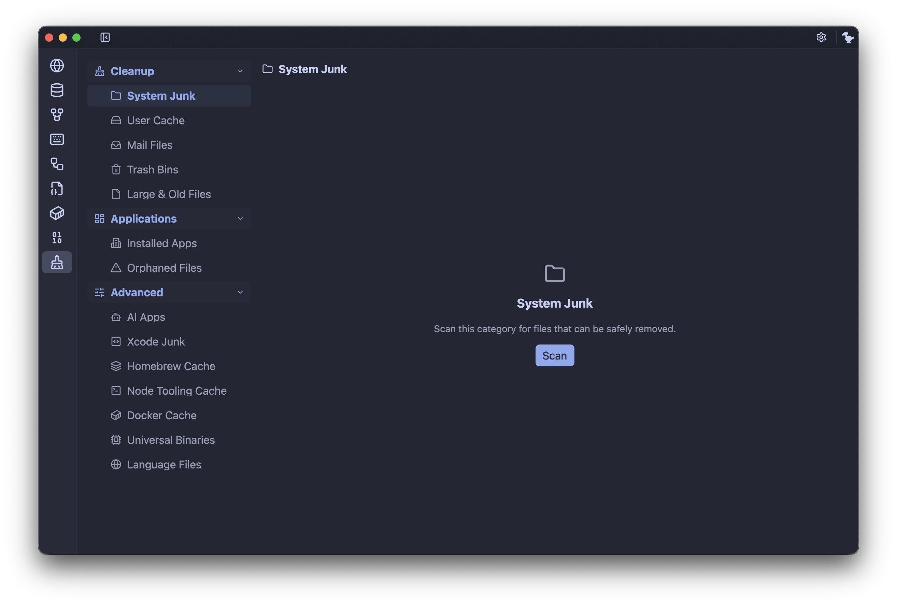

### JSON Formatter

Format, validate, and inspect JSON with syntax highlighting and inline parser errors.

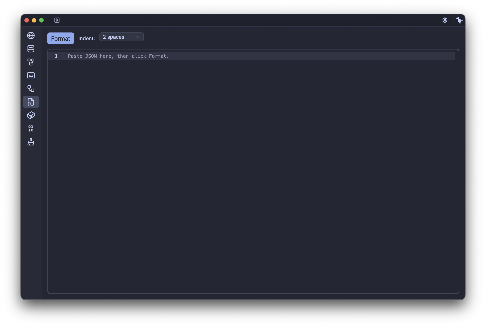

### Encoder / Decoder

Encode and decode Base64, URL, and Hex data, plus quickly inspect JWT headers and payloads.

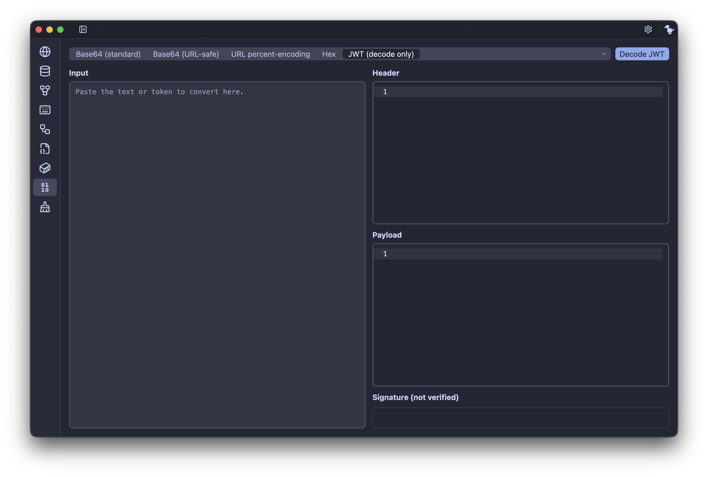

### Vietnamese Input Method

Built-in Vietnamese Telex/VNI input for macOS and Windows with configurable language switching and typing behavior.

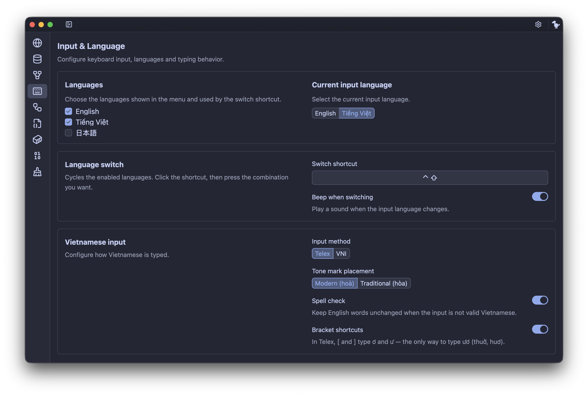

## Quick Navigation

Paste a JSON blob, JWT, `curl` command, or database URI and Dodo can automatically open the right tool with the content already loaded.

Use `Cmd/Ctrl + V` or simply `p` when no input field is focused.

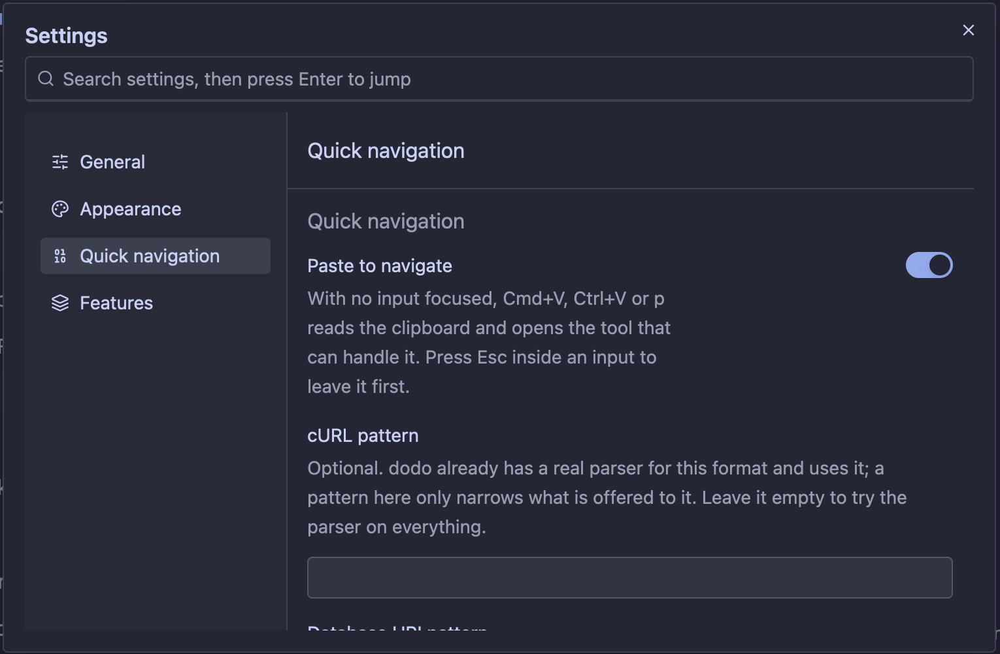

## Settings

Customize themes, language, appearance, enabled features, sidebar order, Quick Navigation, startup behavior, input method, and more.

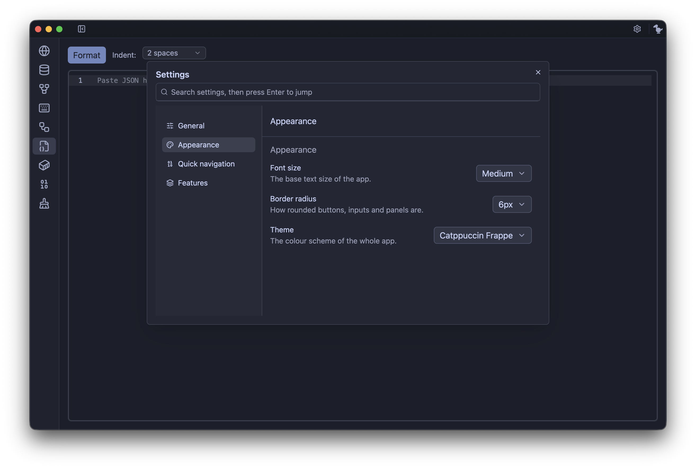

## Install

Download the latest build from:

**[GitHub Releases](https://github.com/MrGru/dodo/releases/latest)**

> [!WARNING]
> Current builds are **not code-signed or notarized**.

### macOS

Download the `-app` archive:

```text
dodo-v<version>-macos-arm64-app.tar.gz
```

For Intel Macs, use the `macos-x64` build.

```sh
tar -xzf dodo-v<version>-macos-arm64-app.tar.gz
xattr -dr com.apple.quarantine dodo.app
mv dodo.app /Applications
```

The plain `dodo-v<version>-macos-<arch>.tar.gz` contains only the binary and is intended for terminal use.

### Windows

Download:

```text
dodo-v<version>-windows-x64.zip
```

Extract the archive and run `dodo.exe`.

### Linux

Download:

```text
dodo-v<version>-linux-x64.tar.gz
```

Then:

```sh
tar -xzf dodo-v<version>-linux-x64.tar.gz
cd dodo-v<version>-linux-x64
cp -r share ~/.local/
./dodo
```

## Verify Downloads

Every release includes `SHA256SUMS` and a `.sha256` sidecar for each archive.

```sh
sha256sum -c SHA256SUMS
```

On macOS:

```sh
shasum -a 256 -c SHA256SUMS
```

You can inspect build information with:

```sh
dodo --build-info
```

## Platform Status

| Platform | Architecture  | Status   |
| -------- | ------------- | -------- |
| macOS    | Apple Silicon | Tested   |
| macOS    | Intel         | CI build |
| Windows  | x64           | CI build |
| Linux    | x64           | CI build |

macOS arm64 is currently the primary development and real-device testing target.

Other platforms are built and package-verified by CI but may still have platform-specific rough edges.

## Build from Source

Dodo requires Rust **1.85+** with Edition 2024 support.

```sh
git clone https://github.com/MrGru/dodo.git
cd dodo
cargo run
```

Several feature crates can also be launched independently:

```sh
cargo run -p dodo-cleaner         --example cleaner         --locked
cargo run -p dodo-docker          --example docker          --locked
cargo run -p dodo-database        --example database        --locked
cargo run -p dodo-api-explorer    --example api_explorer    --locked
cargo run -p dodo-json-formatter  --example json_formatter  --locked
cargo run -p dodo-encoder-decoder --example encoder_decoder --locked
```

Vietnamese input engine:

```sh
cargo run -p dodo-ime-core --example telex
```

See [`docs/contributing.md`](docs/contributing.md) for contributor setup and repository details.

## Status

Dodo is currently **pre-1.0**.

The main tools are functional, but some areas are still evolving. Known gaps include OAuth 2.0 in API Explorer, additional Docker operations, database autocomplete and sorting, and Linux input-method integration.

Bug reports, ideas, and pull requests are welcome.

## Licence

Dodo's own source code is licensed under the **MIT License**. See [`LICENSE`](LICENSE).

The binary also contains third-party code under other licences, including **GPL-3.0-or-later** dependencies reached through GPUI. The implications for redistribution of built Dodo binaries are currently an open question.

See [`THIRD-PARTY-NOTICES.md`](THIRD-PARTY-NOTICES.md) before redistributing a build.

---

<div align="center">

**Dodo — one native app for the developer tools you use every day.**

</div>
